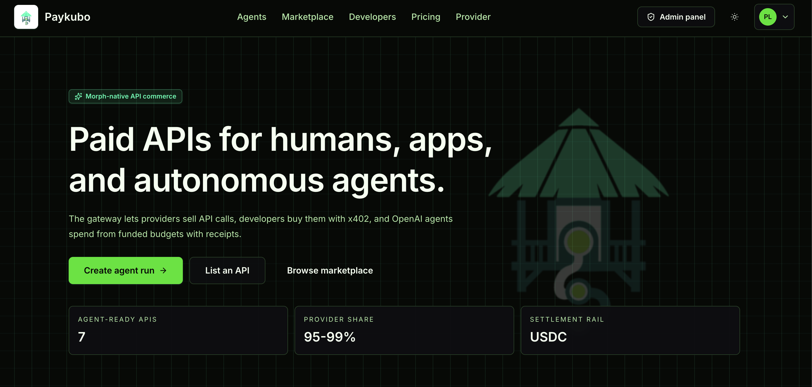

# Paykubo

[](https://youtu.be/ucTiJrKCOwg)

USDC-native API commerce for humans, applications, and AI agents on configurable
EVM rails.

Paykubo is a paid API marketplace and gateway. Providers list paid endpoints,
buyers and agents pay per request using the configured payment token, and
Paykubo handles discovery, x402 payment flow, request forwarding, receipts,
usage records, and provider dashboards.

## Highlights

- Next.js 15 + React 19 App Router setup.
- Configurable EVM chain metadata with native gas and RainbowKit wallet support.
- RainbowKit-compatible wallet onboarding.
- Marketplace catalog with USDC prices, provider badges, x402 flags, and
  agent-ready API details.
- Autonomous Launch Pack Agent runs with an OpenAI planner and synthesizer that
  choose paid tools, buy selected APIs, return deliverables, and publish
  on-chain proof pages. A deterministic planner is available when no OpenAI key
  is set.
- Provider dashboard with API call, revenue, success-rate, and fee-split
  metrics.
- Provider product management for listing APIs, validating schemas, reviewing
  product status, copying gateway endpoints, and testing paid request setup.
- Buyer order lifecycle pages for payment-required, processing, completed,
  failed, and expired API requests, with browser wallet x402 checkout, USDC
  settlement, provider results, and receipt links.
- Managed credits for teams that prefer API-key usage after recording USDC
  top-ups.
- x402-protected product call route for settlement through the configured
  facilitator.
- Public proof pages for autonomous runs with receipt rollups, proof hashes, and
  explorer links.
- Generic external HTTP adapter for provider-created APIs, including private
  upstream auth, async job polling, and result-path extraction behind the same
  paid gateway contract.
- OpenAPI import for faster provider onboarding from hosted JSON/YAML specs or
  uploaded files.
- OpenAPI JSON and Scalar API reference for gateway, receipt, provider, and
  agent routes.
- Receipt pages with USDC amount, fee split, payer, provider wallet, transaction
  hash, and explorer links.
- Admin moderation pages for API products and buyer request operations.
- Convex schema for providers, API products, versions, orders, receipts,
  requests, usage events, webhooks, payouts, examples, and reviews.
- Admin panel and wallet-protected app routes.
- Light/dark mode using `next-themes`.

## Getting Started

```bash
pnpm install
pnpm dev
```

## Convex

```bash
pnpm convex:dev
pnpm convex:deploy
pnpm seed:database
pnpm seed:admin-tools
```

`seed:database` upserts wallet-scoped users with associated provider profiles.
`seed:admin-tools` upserts the public provider-owned marketplace tools. Both
commands use the configured `NEXT_PUBLIC_CONVEX_URL`.

## EVM Chain

Paykubo defaults to Morph Hoodi Testnet for USDC-paid API commerce. To migrate to
another EVM network, update the `NEXT_PUBLIC_EVM_*`,
`NEXT_PUBLIC_PAYMENT_TOKEN_*`, `NEXT_PUBLIC_X402_NETWORK`, and
`X402_FACILITATOR_*` values, then redeploy the contracts on that target chain.

- Chain ID: `2910`
- CAIP-2 network: `eip155:2910`
- RPC: `https://rpc-hoodi.morph.network`
- Explorer: `https://explorer-hoodi.morph.network`
- Native gas currency: `ETH`
- x402 facilitator: `https://morph-rails-hoodi.morph.network/x402/v2`

### Current Contracts

- SubscriptionManager: `0x07870EbBE687D98F5636b66c26e4005A854B8921`
- AgentRunAttestor: `0xB031aCC58b182e34262FC7903d05e62AD30a48C8`
- ApiPaymentEscrow: `0x8D875d4596f3BaA32552A5bf094f60446C864970`
- AgentRunVault: `0xDcC0FB6e9061e25BCd1042227777F37d124b670f`

## Paid API Calls

Raw `curl` requests intentionally return `402 Payment Required` because the
server is advertising the USDC payment requirements. External developers do not
need to clone this repository to use Paykubo APIs; they install the x402 buyer
SDK in their own backend, CLI, or agent and call the hosted Paykubo product
endpoint.

After publishing a provider product, set `AGENT_SPENDER_PRIVATE_KEY` or
`EVM_PRIVATE_KEY` to a wallet funded with the configured payment token and run
the hosted product slug:

```bash
pnpm x402:call media-launch-job-api
```

The command uses `@x402/fetch` to sign the payment, retry the request, and print
the settled response.

Humans can also open a marketplace product, create a payable request, and click
`Run with wallet` to check USDC readiness, sign the x402
payment from the connected browser wallet, and receive the provider response.
Teams that want API-key ergonomics can use `/billing` to create a managed credit
account and call `/api/credits/products/{slug}/call` with a Paykubo API key.

Providers can open `/provider/products/new` and import an OpenAPI JSON/YAML URL
or file to prefill endpoint URL, method, auth type, schemas, sample payload,
async polling, and result-path fields before publishing a paid listing.

## Walkthrough And Deployment

- Deployment checklist:
  [docs/deployment-checklist.md](docs/deployment-checklist.md)
- Walkthrough script: [docs/demo-script.md](docs/demo-script.md)
- API reference: `/api/reference`
- OpenAPI JSON: `/api/openapi.json`
- Operations health: `/api/health`

Deploy manually with the Vercel CLI:

```bash
pnpm add -D vercel@latest
pnpm exec vercel login
pnpm exec vercel --prod
```

Run `pnpm exec vercel login` only when the CLI is not authenticated. The current
Vercel CLI login flow uses browser-based OAuth device authorization; do not pass
an email address or deprecated provider flags to the login command. If using the
global `vercel` command directly, update it with `npm i -g vercel@latest`.

Manage Vercel project environment variables with the CLI:

```bash
pnpm exec vercel env ls
pnpm exec vercel env add NEXT_PUBLIC_CONVEX_URL production --force
pnpm exec vercel env add AGENT_LLM_API_KEY production --force
pnpm exec vercel env pull .env.local
pnpm exec vercel --prod
```

Use `vercel env add <name> production --force` to create or update a production
variable. Redeploy with `pnpm exec vercel --prod` after environment changes so
the new values are available to the build and runtime.

To replace Vercel production environment variables with the values currently in
`.env.local`, upsert the local keys with `vercel env add --force`, then
redeploy:

```bash
pnpm vercel:env:sync:production
```

Use `pnpm vercel:env:sync:preview` or `pnpm vercel:env:sync:development` to
reset those Vercel environments without a production redeploy. The sync script
requires an existing Vercel project link and never pulls Vercel env values into
`.env.local`. If the project is not linked yet, run `pnpm exec vercel link`
first and do not pull environment variables when prompted. The sync script
creates or replaces keys present in `.env.local`; remove extra Vercel-only keys
manually with `pnpm exec vercel env rm <KEY> production --yes`.

## Environment

Copy `.env.example` to `.env.local` and configure the values for your local
deployment.

Key values:

- `NEXT_PUBLIC_WALLET_PROVIDER=rainbowkit`
- `NEXT_PUBLIC_WALLETCONNECT_PROJECT_ID`
- `NEXT_PUBLIC_EVM_CHAIN_ID=2910`
- `NEXT_PUBLIC_EVM_RPC_URL=https://rpc-hoodi.morph.network`
- `NEXT_PUBLIC_EVM_EXPLORER_URL=https://explorer-hoodi.morph.network`
- `NEXT_PUBLIC_X402_NETWORK=eip155:2910`
- `NEXT_PUBLIC_PAYMENT_TOKEN_ADDRESS`
- `NEXT_PUBLIC_PAYMENT_TOKEN_NAME`
- `NEXT_PUBLIC_PAYMENT_TOKEN_SYMBOL`
- `NEXT_PUBLIC_PAYMENT_TOKEN_LABEL`
- `NEXT_PUBLIC_PAYMENT_TOKEN_VERSION`
- `NEXT_PUBLIC_PAYMENT_TOKEN_DECIMALS`
- `NEXT_PUBLIC_PAYMENT_TOKEN_TRANSFER_METHOD=eip3009`
- `X402_FACILITATOR_URL=https://morph-rails-hoodi.morph.network/x402/v2`
- `AGENT_SPENDER_PRIVATE_KEY`
- `AGENT_ATTESTER_PRIVATE_KEY`
- `AGENT_LLM_API_KEY`
- `AGENT_LLM_MODEL=gpt-5.2`
- `NEXT_PUBLIC_AGENT_ATTESTOR_ADDRESS`

## Autonomous Agent Walkthrough

1. Open `/agents/new`.
2. Enter a launch-pack goal, budget cap, and allowed tools. The owner is the
   connected wallet and is not typed manually.
3. Start the run, open `/agents/[runId]`, and execute paid actions.
4. Attest the completed run and open `/proofs/[proofId]`.
5. For OpenAI-planned agent runs, set `AGENT_LLM_API_KEY` and optionally
   `AGENT_LLM_MODEL`; otherwise the run is labeled as deterministic fallback.
6. For x402 settlement, fund the agent run vault from the browser wallet and set
   `NEXT_PUBLIC_APP_URL` to the deployed app URL. The agent spender signs
   payments and only needs native gas for settlement-token return transactions.
   Use `NEXT_PUBLIC_PAYMENT_TOKEN_SYMBOL` and `NEXT_PUBLIC_PAYMENT_TOKEN_LABEL`
   to change UI copy for USDC or another settlement token. Paykubo's Morph
   configuration uses `NEXT_PUBLIC_PAYMENT_TOKEN_TRANSFER_METHOD=eip3009` for
   EIP-3009 transfer-with-authorization flows.

## Core Commands

```bash
pnpm dev
pnpm build
pnpm start
pnpm lint
pnpm typecheck
pnpm convex:dev
pnpm convex:deploy
```
